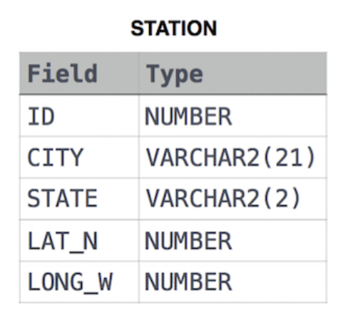

# SQL Practice

This repository contains my SQL practice solutions, mainly focused on solving SQL problems and improving my SQL query-writing and problem-solving skills.
### Platform

HackerRank

### Language

MySQL

---

## 1. Cities Starting with Vowels

### Problem

Query the list of `CITY` names from the `STATION` table that start with a vowel (`a`, `e`, `i`, `o`, or `u`).

The result should not contain duplicate city names.

### STATION Table



### SQL Solutions

```sql
-- Solution 1: Using LIKE

SELECT DISTINCT CITY
FROM STATION
WHERE CITY LIKE 'a%'
   OR CITY LIKE 'e%'
   OR CITY LIKE 'i%'
   OR CITY LIKE 'o%'
   OR CITY LIKE 'u%';
```
```sql
-- Solution 2: Using REGEXP

SELECT DISTINCT CITY
FROM STATION
WHERE CITY REGEXP '^[AEIOUaeiou]';
```

### Explanation

**Solution 1 — LIKE**

- `DISTINCT` removes duplicate city names.
- `LIKE 'a%'` finds cities starting with `a`.
- Similarly, `e%`, `i%`, `o%`, and `u%` find cities starting with the other vowels.
- `%` represents any sequence of characters.

**Solution 2 — REGEXP**

- `REGEXP '^[AEIOUaeiou]'` checks whether the city starts with a vowel.
- `^` represents the beginning of the string.
- `[AEIOUaeiou]` matches any uppercase or lowercase vowel.

